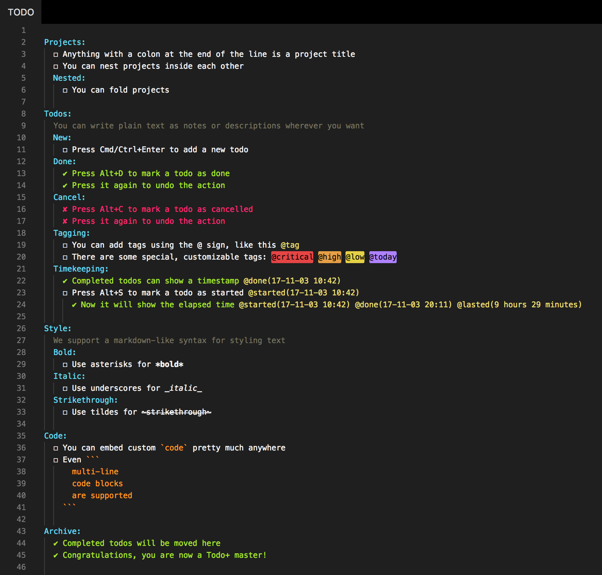

# Todo+

<p align="center">
	
</p>

Manage todo lists with ease. Powerful, easy to use and customizable.

## Features

- **Easy to use**: you're just a few shortcuts away from becoming a master
- **Portable**: being a plain text format you can read and edit it using any editor
- **Custom symbols**: you can replace the default symbols with any of the supported ones
  - **Box**: - ❍ ❑ ■ ⬜ □ ☐ ▪ ▫ – — ≡ → › [ ]
  - **Done**: ✔ ✓ ☑ + [x] [X] [+]
  - **Cancel**: ✘ x X [-]
- **Code blocks**: you can define code blocks by wrapping them in backticks (`)
- **Custom colors**: all colors can be customized
- **Custom special tags**: special tags' names and their colors can be customized
- **Timekeeping**: you can mark todos as started and track elapsed time until completion
- **Archive**: you can move completed todos to a special "Archive" section with a shortcut
- **Embedded todos**: it's common to have //TODO or //FIXME comments to your code, this extension can detect those as well

## Install

Follow the instructions in the [Marketplace](https://marketplace.visualstudio.com/items?itemName=fabiospampinato.vscode-todo-plus), or run the following in the command palette:

```shell
ext install fabiospampinato.vscode-todo-plus
```

## Usage

It adds 7 commands to the command palette:

```js
'Todo: Open' // Open or create your project's todo file
'Todo: Open Embedded' // Open embedded todos
'Todo: Start' // Mark a todo as started
'Todo: Toggle Box' // Toggle todo's box symbol
'Todo: Toggle Cancel' // Toggle todo's done symbol
'Todo: Toggle Done' // Toggle todo's cancel symbol
'Todo: Archive' // Archive completed todos
```

It adds 5 shortcuts when editing a `Todo` file:

```js

'Cmd/Ctrl+Shift+A' // Triggers  `Todo: Archive`
'Cmd/Ctrl+Enter' // Triggers `Todo: Toggle Box`
'Alt+D' // Triggers `Todo: Toggle Done`
'Alt+C' // Triggers `Todo: Toggle Cancel`
'Alt+S' // Triggers `Todo: Start`
```

## Settings

```js
{
  "todo.file": "TODO", // Todo file name. Other supported names are: `*.todo`, `*.todos`, `*.task`, `*.tasks`, `*.taskpaper` and `todolist.txt`
  "todo.defaultContent": "\nTodo:\n  ☐ Item\n", // New todo files default content
  "todo.indentation": "  ", // String used for indentation
  "todo.symbols.box": "☐", // Box symbol
  "todo.symbols.done": "✔", // Done symbol
  "todo.symbols.cancel": "✘", // Cancel symbol
  "todo.colors.cancel": "#f92672", // Cancelled todo color
  "todo.colors.done": "#a6e22e", // Done todo color
  "todo.colors.code": "#fd971f", // Code color
  "todo.colors.comment": "#75715e", // Comment color
  "todo.colors.project": "#66d9ef", // Project color
  "todo.colors.tag": "#e6db74", // Tag color
  "todo.tags.names": ["critical", "high", "low", "today"], // Special tags' names
  "todo.tags.backgroundColors": ["#e54545", "#e59f45", "#e5d145", "#ae81ff"], // Special tags' background colors
  "todo.tags.foregroundColors": ["#000000", "#000000", "#000000", "#000000"], // Special tags' foreground colors
  "todo.formatting.enabled": true, // Enable markdown-like formatting
  "todo.timekeeping.started.format": "YY-MM-DD HH:mm", // Format used for displaying time inside @started
  "todo.timekeeping.finished.enabled": true, // Enable the @done/cancelled tag. It's always enabled if you explicitly start a todo
  "todo.timekeeping.finished.format": "YY-MM-DD HH:mm", // Format used for displaying time inside @done/cancelled
  "todo.timekeeping.elapsed.enabled": true, // Enable the @lasted/wasted tag
  "todo.archive.name": "Archive", // Name of the special "Archive" section
  "todo.embedded.regex": "(?:#|//|/\\*) ?(TODO|FIXME|FIX|BUG|UGLY|HACK|NOTE|IDEA|REVIEW|DEBUG|OPTIMIZE)(?: |:|$)", //Regex used for finding embedded todos, requires double escaping
  "todo.embedded.include": ["**/*"], //Globs to use for including files
  "todo.embedded.exclude": ["**/.git", ...], //Globs to use for excluding files
  "todo.embedded.limit": 5120, //Maximum number of files to search
  "todo.embedded.groupByFile": false // Group todos by file
}
```

Dates are formatted using [moment](https://momentjs.com/docs/#/displaying/format/).

## Demo

### [Example todo file](https://github.com/fabiospampinato/vscode-todo-plus/blob/master/resources/readme.todo)



### Embedded todos


## Related:

- **[Highlight](https://marketplace.visualstudio.com/items?itemName=fabiospampinato.vscode-highlight)**: I recommend using this extension for highlighting your embedded todos.

- **[Projects+ Todo+](https://marketplace.visualstudio.com/items?itemName=fabiospampinato.vscode-projects-plus-todo-plus)**: Bird's-eye view over your projects, view all your todo files aggregated into one.

- **[Noty](https://github.com/fabiospampinato/noty)**: Autosaving sticky note with support for multiple notes, find/replace, programmers shortcuts and more. It implements a subset of the functionalities provided by this extension.

## License

MIT © Fabio Spampinato
