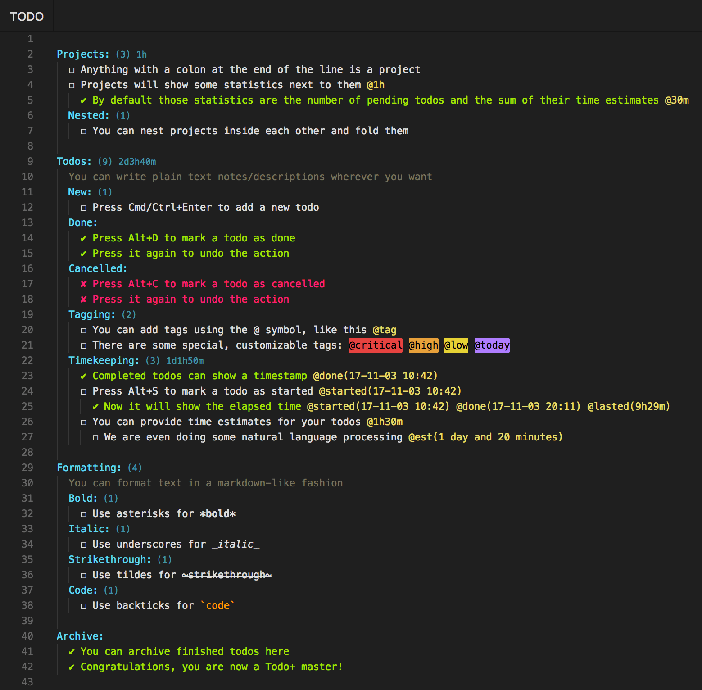
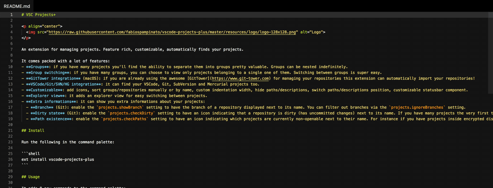
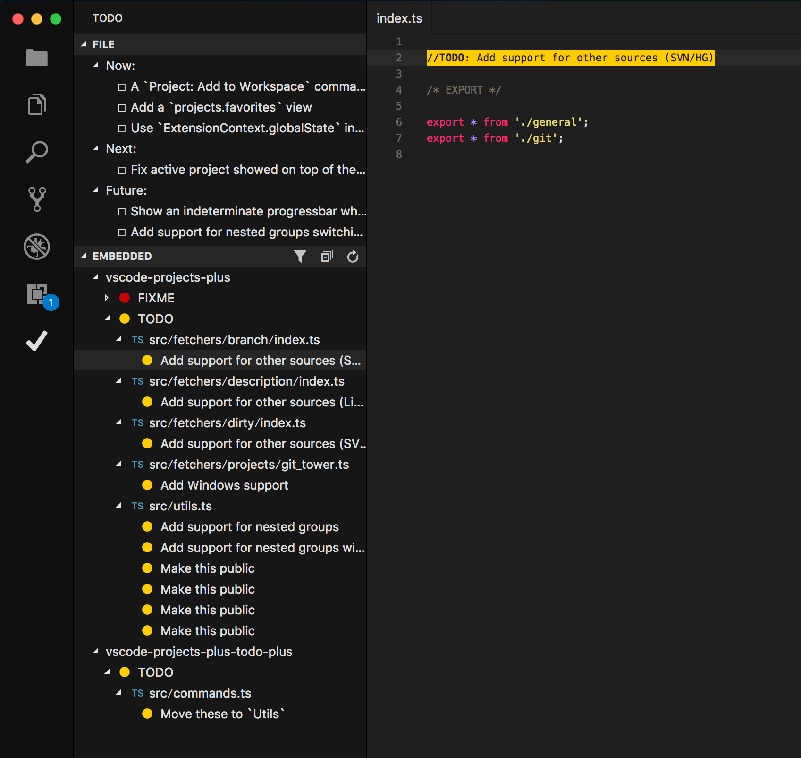
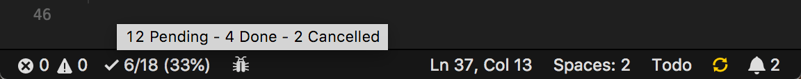
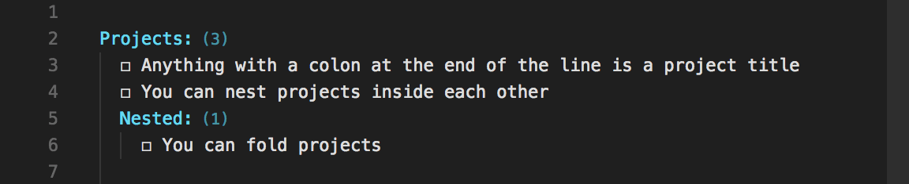
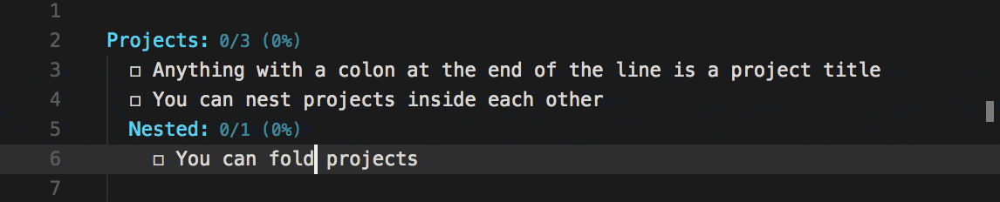
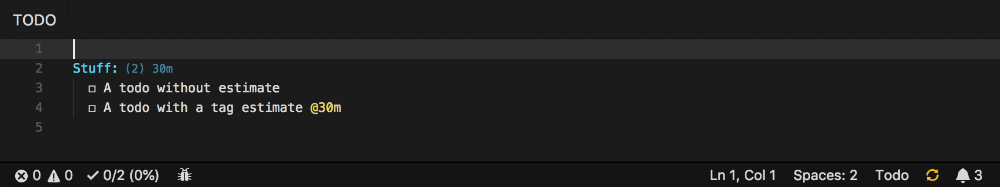

# Todo+

<p align="center">
  
</p>

Manage todo lists with ease. Powerful, easy to use and customizable. [View the demo](#demo).

## Features

- **Easy to use**: you're just a few shortcuts away from becoming a master
- **Portable**: being a plain text format you can read and edit it using any editor
- **Custom symbols**: you can replace the default symbols with any of the supported ones
  - **Box**: `-` `❍` `❑` `■` `⬜` `□` `☐` `▪` `▫` `–` `—` `≡` `→` `›` `[]` `[ ]`
  - **Done**: `✔` `✓` `☑` `+` `[x]` `[X]` `[+]`
  - **Cancelled**: `✘` `x` `X` `[-]`
- **Custom colors**: all colors can be customized
- **Custom special tags**: special tags' names and their colors can be customized
- **Archive**: you can move finished todos to a special "Archive" section with a shortcut
- **Formatting**: you can format text in a markdown-like fashion, we support: **bold**, _italic_, ~~strikethrough~~ and `code`
- **Go To Symbol**: you can easily move between projects by using the `Go to Symbol in File...` command
- **[TaskPaper](https://www.taskpaper.com) compatible**: just set `todo.symbols.box`, `todo.symbols.done` and `todo.symbols.cancelled` to `-`
- **Timekeeping**: you can mark todos as started and track elapsed time until completion
- **Timer**: a timer can be displayed in the statusbar for started todos
- **Time estimates**: you can estimate the time it will take to complete a todo by adding a tag to it that looks like this: `@est(3 hours)`, `@est(2h30m)` or `@2h30m`. Then you can use the `[est]` token in statistics
- **Statistics**: statistics about your entire file and/or project-level statistics about your individual projects
- **Embedded todos**: it's common to have `//TODO` or `//FIXME` comments in our code, this extension can find those as well
- **Activity bar views**: you can view your todo file and your embedded todos from a custom activity bar section

## Install

Follow the instructions in the [Marketplace](https://marketplace.visualstudio.com/items?itemName=fabiospampinato.vscode-todo-plus), or run the following in the command palette:

```shell
ext install fabiospampinato.vscode-todo-plus
```

## Usage

It adds 8 commands to the command palette:

```js
'Todo: Open' // Open or create your project's todo file
'Todo: Open Embedded' // Open embedded todos
'Todo: Toggle Box' // Toggle todo's box symbol
'Todo: Toggle Done' // Toggle todo's done symbol
'Todo: Toggle Cancelled' // Toggle todo's cancelled symbol
'Todo: Toggle Start' // Toggle a todo as started
'Todo: Toggle Timer' // Toggle the timer
'Todo: Archive' // Archive finished todos
```

It adds 5 shortcuts when editing a `Todo` file:

```js
'Cmd/Ctrl+Enter' // Triggers `Todo: Toggle Box`
'Alt+D' // Triggers `Todo: Toggle Done`
'Alt+C' // Triggers `Todo: Toggle Cancelled`
'Alt+S' // Triggers `Todo: Toggle Start`
'Cmd/Ctrl+Shift+A' // Triggers  `Todo: Archive`
```

## Settings

```js
{
  "todo.file.name": "TODO", // Todo file name. Other supported names are: `*.todo`, `*.todos`, `*.task`, `*.tasks`, `*.taskpaper` and `todolist.txt`
  "todo.file.defaultContent": "\nTodo:\n  ☐ Item\n", // New todo files default content
  "todo.file.include": ["**/TODO", ...], // Globs to use for including files
  "todo.file.exclude": ["**/.!(todo|todos|task|tasks)/**", ...], // Globs to use for excluding files
  "todo.file.view.expanded": true, // Start the tree in an expanded state
  "todo.indentation": "  ", // String used for indentation
  "todo.symbols.box": "☐", // Box symbol
  "todo.symbols.done": "✔", // Done symbol
  "todo.symbols.cancelled": "✘", // Cancelled symbol
  "todo.colors.done": "#a6e22e", // Done todo color
  "todo.colors.cancelled": "#f92672", // Cancelled todo color
  "todo.colors.code": "#fd971f", // Code color
  "todo.colors.comment": "#75715e", // Comment color
  "todo.colors.project": "#66d9ef", // Project color
  "todo.colors.projectStatistics": "#4694a3", // Project statistics color
  "todo.colors.tag": "#e6db74", // Tag color
  "todo.colors.tags.background": ["#e54545", "#e59f45", "#e5d145", "#ae81ff"], // Special tags' background colors
  "todo.colors.tags.foreground": ["#000000", "#000000", "#000000", "#000000"], // Special tags' foreground colors
  "todo.colors.types": { "TODO": "#ffcc00", "FIXME": "#cc0000" ... }, // Object mapping todo types to their color
  "todo.colors.dark": { /* "done": "white", ... */ }, // Colors for dark themes
  "todo.colors.light": { /* "done": "black", ... */ }, // Colors for light themes
  "todo.tags.names": ["critical", "high", "low", "today"], // Special tags' names
  "todo.tags.namesInference": true, // Infer commonly used tags' names
  "todo.archive.name": "Archive", // Name of the special "Archive" section
  "todo.archive.remove.emptyProjects": true, // Remove projects without todos
  "todo.archive.remove.emptyLines": 1, // Remove extra empty lines, keeping no more than `emptyLinesThreshold` consecutive empty lines
  "todo.archive.project.enabled": true, // Enable the @project tag
  "todo.archive.project.separator": ".", // String used for joining multiple projects
  "todo.archive.sortByDate": false, // Sort lines by finished date
  "todo.formatting.enabled": true, // Enable markdown-like formatting
  "todo.timekeeping.created.enabled": false, // Enable the @created tag
  "todo.timekeeping.created.time": true, // Insert the time inside the @created tag
  "todo.timekeeping.created.format": "YY-MM-DD HH:mm", // Format used for displaying time inside @created
  "todo.timekeeping.started.time": true, // Insert the time inside the @started tag
  "todo.timekeeping.started.format": "YY-MM-DD HH:mm", // Format used for displaying time inside @started
  "todo.timekeeping.finished.enabled": true, // Enable the @done/cancelled tag. It's always enabled if you explicitly start a todo or if you use only 1 symbol
  "todo.timekeeping.finished.time": true, // Insert the time inside the @done/cancelled tag
  "todo.timekeeping.finished.format": "YY-MM-DD HH:mm", // Format used for displaying time inside @done/cancelled
  "todo.timekeeping.elapsed.enabled": true, // Enable the @lasted/wasted tag
  "todo.timekeeping.elapsed.format": "short-compact", // Format used for displaying time diff inside @lasted/waster
  "todo.timekeeping.estimate.format": "short-compact", // Format used for the `[est]` token
  "todo.timer.statusbar.enabled": true, // Show a timer for started todos in the statusbar
  "todo.timer.statusbar.alignment": "left", // Should the item be placed to the left or right?
  "todo.timer.statusbar.color": "", // The foreground color for this item
  "todo.timer.statusbar.priority": -10, // The priority of this item. Higher value means the item should be shown more to the left
  "todo.statistics.project.enabled": "global.projects < 100 && project.pending > 0", // Show statistics next to a project, boolean or JS expression
  "todo.statistics.project.text": "([pending]) [est]", // Template used for rendering the text
  "todo.statistics.statusbar.enabled": "global.all > 0", // Show statistics in the statusbar, boolean or JS expression
  "todo.statistics.statusbar.ignoreArchive": true, // Ignore the archive when rendering statistics in the statusbar
  "todo.statistics.statusbar.alignment": "left", // Should the item be placed to the left or right?
  "todo.statistics.statusbar.color": "", // The foreground color for this item
  "todo.statistics.statusbar.command": "", // Command to execute on click
  "todo.statistics.statusbar.priority": -1, // The priority of this item. Higher value means the item should be shown more to the left
  "todo.statistics.statusbar.text": "$(check) [finished]/[all] ([percentage]%)", // Template used for rendering the text
  "todo.statistics.statusbar.tooltip": "[pending] Pending - [done] Done - [cancelled] Cancelled", // Template used for rendering the tooltip
  "todo.embedded.regex": "(?:<!-- *)?(?:#|//|/\\*+|<!--|--|\\* @|\\{!|\\{\\{!--|\\{\\{!) *(TODO|FIXME|FIX|BUG|UGLY|HACK|NOTE|IDEA|REVIEW|DEBUG|OPTIMIZE)(?:\\s*\\([^)]+\\))?:?(?!\\w)(?: *-->| *\\*/| *!}| *--}}| *}}|(?= *(?:[^:]//|/\\*+|<!--|@|--|\\{!|\\{\\{!--|\\{\\{!))|((?: +[^\\n@]*?)(?= *(?:[^:]//|/\\*+|<!--|@|--(?!>)|\\{!|\\{\\{!--|\\{\\{!))|(?: +[^@\\n]+)?))", // Regex used for finding embedded todos, requires double escaping
  "todo.embedded.regexFlags": "gi", // Regex flags to use
  "todo.embedded.include": ["**/*"], // Globs to use for including files
  "todo.embedded.exclude": ["**/.*", "**/.*/**", ...], // Globs to use for excluding files
  "todo.embedded.provider": "", // The provider to use when searching for embedded todos
  "todo.embedded.providers.ag.regex": "(?:#|//|/\\*+|<!--|--|\\* @|\\{!|\\{\\{!--|\\{\\{!) *(TODO|FIXME|FIX|BUG|UGLY|HACK|NOTE|IDEA|REVIEW|DEBUG|OPTIMIZE)", // Regex used by ag, requires double escaping
  "todo.embedded.providers.ag.args": ['--ignore-case'], // Extra arguments to pass to ag
  "todo.embedded.providers.rg.regex": "(?:#|//|/\\*+|<!--|--|\\* @|\\{!|\\{\\{!--|\\{\\{!) *(TODO|FIXME|FIX|BUG|UGLY|HACK|NOTE|IDEA|REVIEW|DEBUG|OPTIMIZE)", // Regex used by rg, requires double escaping
  "todo.embedded.providers.rg.args": ['--ignore-case'], // Extra arguments to pass to rg
  "todo.embedded.file.wholeLine": true, // Show the whole line
  "todo.embedded.file.groupByRoot": true, // Group embedded todos by workspace root
  "todo.embedded.file.groupByType": true, // Group embedded todos by type
  "todo.embedded.file.groupByFile": true, // Group embedded todos by file
  "todo.embedded.view.wholeLine": false, // Show the whole line
  "todo.embedded.view.groupByRoot": true, // Group embedded todos by workspace root
  "todo.embedded.view.groupByType": true, // Group embedded todos by type
  "todo.embedded.view.groupByFile": true, // Group embedded todos by file
  "todo.embedded.view.expanded": true, // Start the tree in an expanded state
  "todo.embedded.view.icons": true // Show icons next to todos and types"
}
```

Changing some settings (symbols, colors, providers...) requires a restart.

An actual regex will be generated from the value of the `todo.embedded.regex` setting. It uses 2 capturing groups, the first one captures the type of the todo (`TODO`, `FIXME` etc.) and the second one captures an optional description (`TODO: description`).

Dates are formatted using [moment](https://momentjs.com/docs/#/displaying/format).

## Embedded Todos Providers

This extension supports various providers for searching for embedded todos, it'll use the one you set via the `todo.embedded.provider` setting or the first one available between:

1. **[ag / The Silver Searcher](https://github.com/ggreer/the_silver_searcher)**: About 50x faster than the `javascript` provider, it'll use the regex defined under `todo.embedded.providers.ag.regex`. It must be installed in your system.
2. **[rg / ripgrep](https://github.com/BurntSushi/ripgrep)**: About 50x faster than the `javascript` provider, it'll use the regex defined under `todo.embedded.providers.rg.regex`. It doesn't support lookaheads and lookbehinds. It must be installed in your system, or Visual Studio Code must include it.
3. **javascript**: Works on every system, but it's quite slow. This is the fallback provider.

`ag` and `rg` will use their specific regexes for finding the lines containing embedded todos, then those lines will be searched in using the regex defined under `todo.embedded.regex`.

## Statistics Tokens

The following tokens can be used in `todo.statistics.project.text`, `todo.statistics.statusbar.text` and `todo.statistics.statusbar.tooltip`, they will be replaced with the value they represent.

| Token          | Value                            |
|----------------|----------------------------------|
| `[comments]`   | Number of comments               |
| `[projects]`   | Number of projects               |
| `[tags]`       | Number of tags                   |
| `[pending]`    | Number of pending todos          |
| `[done]`       | Number of done todos             |
| `[cancelled]`  | Number of cancelled todos        |
| `[finished]`   | Number of finished todos         |
| `[all]`        | Number of todos                  |
| `[percentage]` | Percentage of finished todos     |
| `[est]`        | Estimated time                   |
| `[lasted]`     | Time the task lasted             |
| `[wasted]`     | Time wasted on task              |
| `[elapsed]`    | Sum of `[lasted]` and `[wasted]` |

## Demo

### [Example todo file](https://github.com/fabiospampinato/vscode-todo-plus/blob/master/resources/readme.todo)



### Embedded todos



### Activity bar views



### Statistics







### Timekeeping & Timer



## Hints

- **Dark/Light Themes**: if you switch between dark and light themes, remember that you can provide specific colors for them via the `todo.colors.dark.*` and `todo.colors.light.*` settings, which will override the default `todo.colors.*` settings.

- **Activity Bar**: you can switch the focus to the `Todo` activity bar view by assigning a shortcut to the `workbench.view.extension.todo` command.

- **Icons**: icons can be used in `todo.statistics.statusbar.text`. [Here](https://octicons.github.com/) you can browse a list of supported icons. If for instance you click the first icon, you'll get a page with `.octicon-alert` written in it, to get the string to use simply remove the `.octicon-` part, so in this case the icon name would be `alert`.

- **CLI**: you can view your embedded todos from the command line with the `todo` command if you install [ag](https://github.com/ggreer/the_silver_searcher) and add the following to your shell configuration file:

```bash
alias todo="ag --color-line-number '1;36' --color-path '1;36' --ignore-case --print-long-lines --silent '(?:<!-- *)?(?:#|//|/\*+|<!--|--) *(TODO|FIXME|FIX|BUG|UGLY|HACK|NOTE|IDEA|REVIEW|DEBUG|OPTIMIZE)(?:\([^(]+\))?:?(?!\w)(?: *-->| *\*/|(?= *(?:[^:]//|/\*+|<!--|@|--))|((?: +[^\n@]*?)(?= *(?:[^:]//|/\*+|<!--|@|--))|(?: +[^@\n]+)?))'"
```

## Related

- **[Highlight](https://marketplace.visualstudio.com/items?itemName=fabiospampinato.vscode-highlight)**: I recommend using this extension for highlighting your embedded todos.

- **[Markdown Todo](https://marketplace.visualstudio.com/items?itemName=fabiospampinato.vscode-markdown-todo#overview)**: Manage todo lists inside markdown files with ease.

- **[Projects+ Todo+](https://marketplace.visualstudio.com/items?itemName=fabiospampinato.vscode-projects-plus-todo-plus)**: Bird's-eye view over your projects, view all your todo files aggregated into one.

- **[Noty](https://github.com/fabiospampinato/noty)**: Autosaving sticky note with support for multiple notes, find/replace, programmers shortcuts and more. It implements a subset of the functionalities provided by this extension.

- **[Notable](https://github.com/fabiospampinato/notable)**: The markdown-based note-taking app that doesn't suck.

## Contributing

If you found a problem, or have a feature request, please open an [issue](https://github.com/fabiospampinato/vscode-todo-plus/issues) about it.

If you want to make a pull request you can debug the extension using [Debug Launcher](https://marketplace.visualstudio.com/items?itemName=fabiospampinato.vscode-debug-launcher).

## License

MIT © Fabio Spampinato
